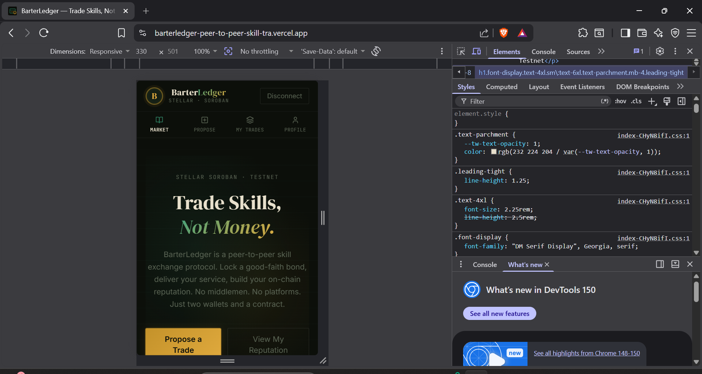
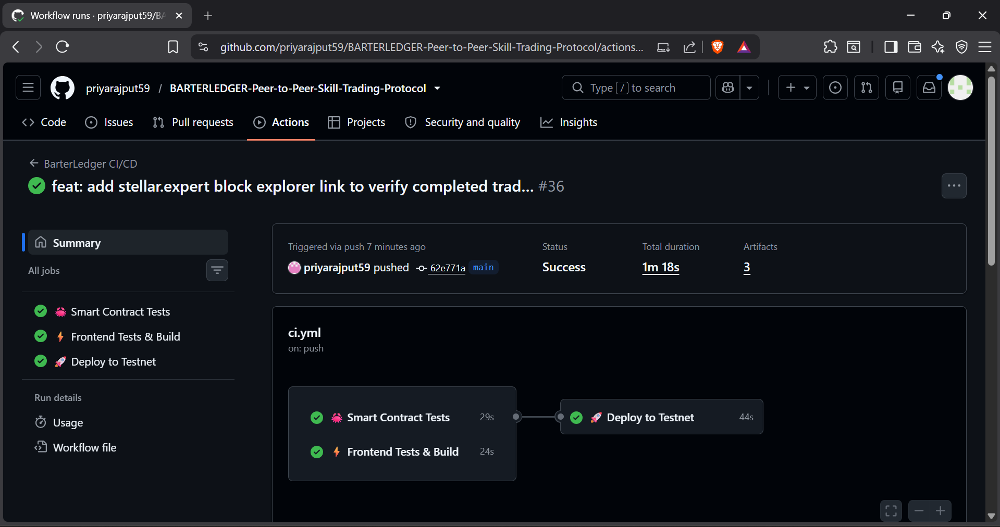
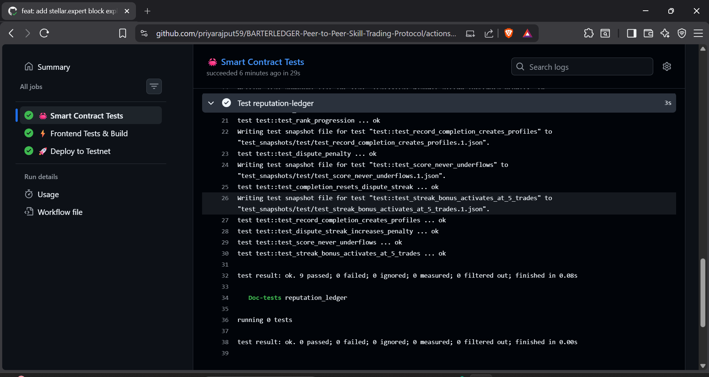
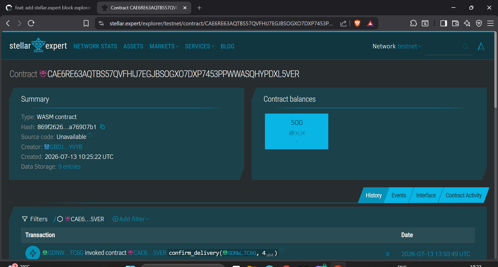

# ⬡ BARTERLEDGER — Peer-to-Peer Skill Trading Protocol

BarterLedger is an advanced, production-ready decentralized peer-to-peer skill barter protocol built on Stellar (Soroban). Two people can agree to exchange services with cryptographic enforcement, collateral bonds, and permanent on-chain reputation tracking.

## 🔗 Live Demo & Video Pitch
- **Live Platform**: [barterledger-peer-to-peer-skill-tra.vercel.app](https://barterledger-peer-to-peer-skill-tra.vercel.app/)
- **Demo Video**: [Watch the Demo on Google Drive](https://drive.google.com/file/d/11HZiG2stKOXq-6RAb8ixDgEgWBiPsCCz/view?usp=sharing)

## 🌟 Key Features

1. **Decentralized Escrow Vaults**: Deposit XLM into smart contract vaults as a good-faith bond when proposing a trade.
2. **Cryptographic Delivery Confirmation**: Both parties must cryptographically sign off on the service delivery to release the funds and mark the trade as Completed.
3. **On-Chain Reputation Ledger**: A secondary smart contract dynamically tracks successful trades and automatically slashes reputation points for disputes, recording them permanently on-chain.
4. **Premium UI**: Built with React, Vite, and Vanilla CSS featuring a stunning dark mode, glassmorphism, and neon accents. Fully mobile responsive and seamlessly integrated with the Freighter wallet.

---

## 📸 Platform Gallery & Submission Requirements

As per the submission checklist, here are the required screenshots demonstrating the platform's capabilities:

### 1. Mobile Responsive UI
The platform is fully responsive and optimized for mobile devices.


### 2. CI/CD Pipeline Running
Automated GitHub Actions workflow running tests and deploying the frontend.


### 3. Test Output (3+ Passing Tests)
Comprehensive Rust integration tests validating the smart contract logic.


### 4. Verified On-Chain State
Explorer view showing the confirmed on-chain state for completed trades.


---

## 🔗 Smart Contract Deployment & Interactivity

The smart contracts are actively deployed on the Stellar Testnet.

- **TradeVault Contract Address**: `CAE6RE63AQTBS57QVFHIJ7EGJBSOGXO7DXP7453PPWWASQHYPDXL5VER`
- **ReputationLedger Contract Address**: `CADK6753ZZ2Z5XZ72FUKYEQJHQMYF4Y2Y4PXV2WMMVUBYV47PUD2GIXI`
- **Transaction Hash**: [`4e5ec22ad749fa810...`](https://stellar.expert/explorer/testnet/contract/CAE6RE63AQTBS57QVFHIJ7EGJBSOGXO7DXP7453PPWWASQHYPDXL5VER) (Accept & Confirm Delivery Interaction)

---

## 🛠️ Tech Stack & Architecture

- **Frontend**: Vite, React, TypeScript, Vanilla CSS (Glassmorphism UI)
- **Blockchain**: Stellar Network, Soroban Smart Contracts (Rust)
- **Wallet Integration**: `@stellar/freighter-api`, `@stellar/stellar-sdk`
- **CI/CD**: GitHub Actions (Automated testing & linting)
- **Deployment**: Vercel

## 🚀 Setup & Deployment

### Run Locally
```bash
# Install dependencies
cd frontend
npm install

# Start development server
npm run dev
```

### Run Tests
```bash
# Run Smart Contract Tests (Rust)
cd contracts/trade-vault
cargo test

cd ../reputation-ledger
cargo test
```

## ✅ Submission Checklist Verification

- [x] Public GitHub repository
- [x] README with complete documentation
- [x] Minimum 10+ meaningful commits
- [x] Live demo link (Vercel)
- [x] Contract deployment address
- [x] Transaction hash for contract interaction
- [x] Screenshot showing Mobile responsive UI
- [x] Screenshot showing CI/CD pipeline running
- [x] Screenshot showing Test output with 3+ passing tests
- [x] Demo video link (1–2 minutes)
